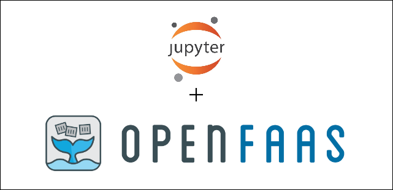

## Serverless Notebooks

Deploy Jupyter Notebooks as serverless functions with OpenFaas.



This repositoy is an example implementation / workflow on how to turn [Jupyter Notebooks](https://jupyter.org/) into serverless functions within [OpenFaas](https://github.com/openfaas/faas).

### Background

Jupyter Notebooks are files containing code, equations, visualizations, and narrative text that can be run in any of the [available jupyter kernels](https://github.com/jupyter/jupyter/wiki/Jupyter-kernels) in your preferred language. Notebooks have a variety of use cases such as data cleaning and transformation, numerical simulation, statistical modeling, data visualization, or machine learning which mostly are developed with research and discovery primarily in mind.

After a notebook is fully developed to produce a meaningful result, it is now a question on how to use it in some broader context. One way to use notebooks as a part of a traditional application is to turn it into an [executable script](https://nbconvert.readthedocs.io/en/latest/usage.html#executable-script) and import it as module. Another way is to [schedule execution of a notebook](https://medium.com/netflix-techblog/notebook-innovation-591ee3221233) based on user defined paramaters.

The first method is great for general applications but any intermediate viewable outputs will be ignored so you must write logic to export results. The later method has greater implications for notebooks and thinks of them not as whole programs, but runnable functions with paramaters. Using a notebook as a function we can try using placing it in a serverless execution environment to provide an easy workflow from research and development to a usable service without writing any server code!

### Getting Started
---

#### Requirements:

---

- [Minikube](https://github.com/kubernetes/minikube) version 0.30.0
- [Docker](https://docs.docker.com/install/)

#### Step one: Build a cluster

This repo requires access to a kubernetes cluster. To create a local cluster with `minikube` you can run 

```shell
## Create unique minikube profile
minikube profile serverless_notebooks

## Start minikube
minikube start \
	 --kubernetes-version=v1.11.0 \
	 --insecure-registry localhost:5000 \
	 --profile serverless_notebooks

## Mount current repo into minikube
## for pod access
minikube mount $(pwd):/mnt &
```

You can also run `./bin/start_minikube.sh` for an easy one liner

#### Step two: Deploy cluster components

To run the notebooks and setup the cluster there are a few sub steps

Setup helm within your cluster

``` shell
echo "Setting up and init ..."
kubectl create serviceaccount -n kube-system tiller
kubectl create clusterrolebinding tiller-cluster-rule --clusterrole=cluster-admin --serviceaccount=kube-system:tiller
helm init --service-account=tiller --tiller-namespace=kube-system

echo "Securing helm..."
kubectl patch deployment tiller-deploy \
	    --namespace=kube-system \
		--type=json \
		--patch='[{"op": "add", "path": "/spec/template/spec/containers/0/command", "value": ["/tiller", "--listen=localhost:44134"]}]'
```

Then deploy `./yml/jupyter.yml` for our jupyter based interactive development environment from within the cluster

``` shell
echo "Deploying single user notebook server ..."
kubectl apply -f yml/jupyter.yml
```

Now deploy OpenFaas using `helm`

``` shell
echo "Adding openfaas to helm repos ..."
helm repo add openfaas https://openfaas.github.io/faas-netes/

echo "Adding openfaas secret ..."
PASSWORD=$(head -c 12 /dev/urandom | shasum| cut -d' ' -f1)
kubectl -n openfaas create secret generic basic-auth \
	--from-literal=basic-auth-user=admin \
	--from-literal=basic-auth-password="$PASSWORD"

echo "Deploying openfaas ..."
helm repo update && \
helm upgrade openfaas \
	 --install openfaas/openfaas \
	 --namespace openfaas  \
	 --set basic_auth=false \
	 --set functionNamespace=openfaas

echo "Upgrading openfaas image pull policy ..."
helm upgrade openfaas openfaas/openfaas --install --set "faasnetesd.imagePullPolicy=IfNotPresent"
```

You can also deploy all these components using the shell script `./bin/deploy_cluster_components.sh`

#### Step three: forward ports from jupyter and openfaas

``` shell
sh -c '(kubectl port-forward -n default svc/jupyter 9999:8888 &\
        kubectl port-forward -n openfaas svc/gateway-external 8080:8080)'
```

You can now go to `localhost:9999` in your browser and navigate to the notebooks for further instructions
